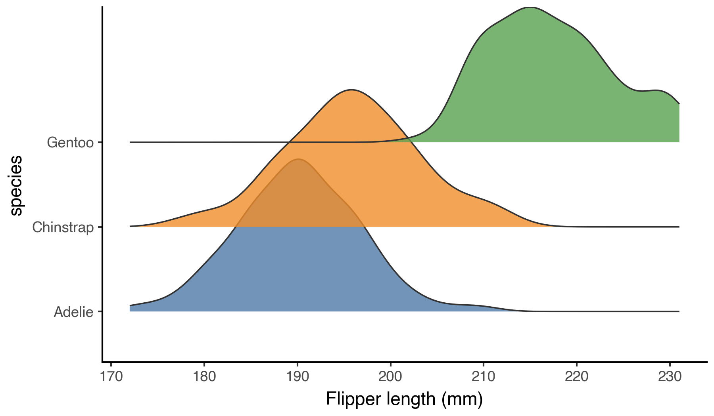
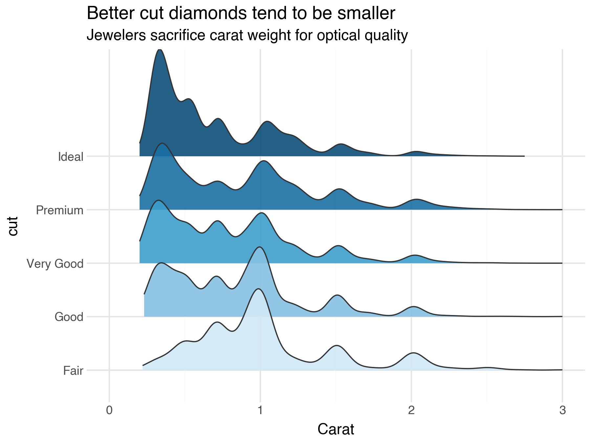
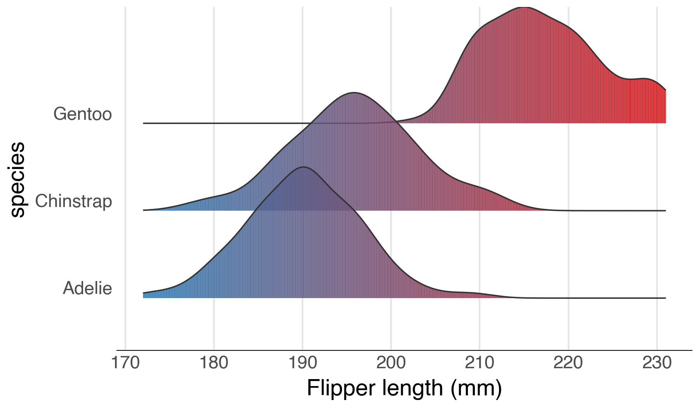
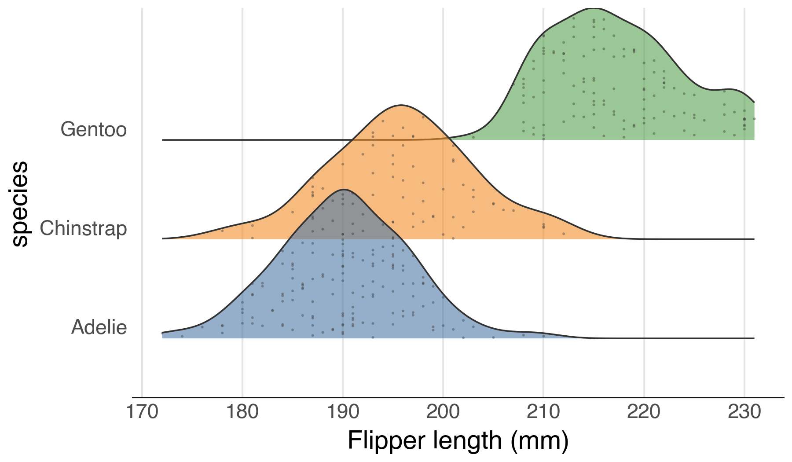
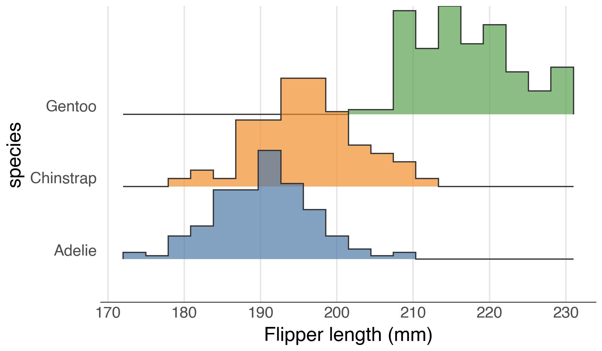
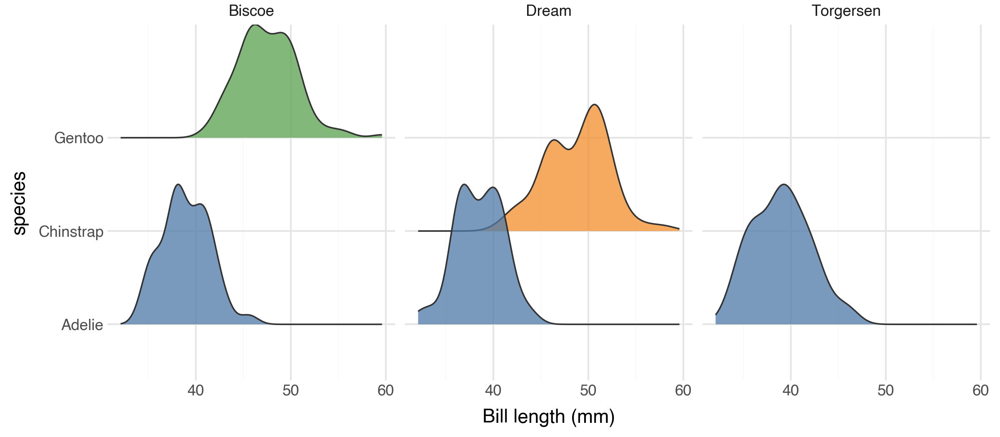
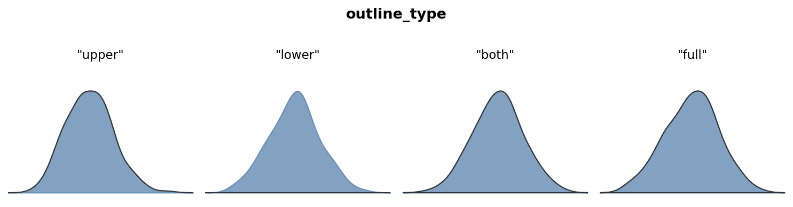

# ridgenine

Ridgeline plots for [plotnine](https://plotnine.org/), inspired by the
[ggridges](https://wilkelab.org/ggridges/) package for ggplot2.

Ridgeline plots display the distribution of a continuous variable across
multiple categories as a series of overlapping density curves — useful for
comparing many distributions at once in a compact, readable layout.



---

## Installation

**pip**

```bash
pip install ridgenine
```

**uv**

```bash
uv add ridgenine
```

---

## Quick start

```python
from plotnine import ggplot, aes
from ridgenine import geom_density_ridges, theme_ridges

(
    ggplot(df, aes("value", "category"))
    + geom_density_ridges()
    + theme_ridges()
)
```

---

## Examples

### Density ridges

`geom_density_ridges` estimates a kernel density for each category and draws
it as a filled ridge. The `scale` parameter controls overlap: `scale=1` means
the tallest ridge exactly reaches the next category's baseline; values above 1
cause overlap, values below 1 leave gaps. Pair with `theme_ridges()` for a
clean, purpose-built look.

Here, a sequential fill palette reinforces the ordering — darker blue means
higher cut quality — revealing that better-cut diamonds tend to be smaller.

```python
import pandas as pd
from plotnine import ggplot, aes, scale_fill_manual, scale_x_continuous
from plotnine.data import diamonds
from ridgenine import geom_density_ridges

cut_order = ["Fair", "Good", "Very Good", "Premium", "Ideal"]
diamonds["cut"] = pd.Categorical(diamonds["cut"], categories=cut_order, ordered=True)

(
    ggplot(diamonds, aes("carat", "cut", fill="cut"))
    + geom_density_ridges(scale=2.0, alpha=0.9, trim=True)
    + scale_fill_manual(values=["#d0e8f5", "#85c1e2", "#3d9fcc", "#1a6fa3", "#0d4f7a"])
    + scale_x_continuous(limits=(0, 3))
)
```



### Gradient fills

`geom_density_ridges_gradient` allows the fill colour to vary continuously
along each ridge. By default, fill is mapped to x position. Pair it with a
continuous colour scale for smooth gradients, or map fill to
`after_stat("quantile")` for discrete quantile bands.

```python
from plotnine import ggplot, aes, scale_fill_gradient
from plotnine.data import penguins
from plotnine.mapping.evaluation import after_stat
from ridgenine import geom_density_ridges_gradient

(
    ggplot(penguins.dropna(), aes("flipper_length_mm", "species", fill=after_stat("x")))
    + geom_density_ridges_gradient(scale=1.5)
    + scale_fill_gradient(low="#2c7bb6", high="#d7191c")
)
```



### Quantile lines

Draw vertical lines at quantile boundaries within each ridge using
`quantile_lines=True`. By default, lines are drawn at the 25th, 50th,
and 75th percentiles. Use `quantiles` to customise the cut points.

```python
from plotnine import ggplot, aes, scale_fill_manual
from plotnine.data import penguins
from ridgenine import geom_density_ridges

(
    ggplot(penguins.dropna(), aes("flipper_length_mm", "species", fill="species"))
    + geom_density_ridges(scale=1.5, alpha=0.7, quantile_lines=True)
    + scale_fill_manual(values=["#4E79A7", "#F28E2B", "#59A14F"])
)
```


### Jittered points

Show the raw data points scattered within each ridge envelope using
`jittered_points=True`. Point appearance is controlled with `point_size`,
`point_alpha`, `point_color`, and `point_shape`.

```python
from plotnine import ggplot, aes, scale_fill_manual
from plotnine.data import penguins
from ridgenine import geom_density_ridges

(
    ggplot(penguins.dropna(), aes("flipper_length_mm", "species", fill="species"))
    + geom_density_ridges(
        scale=1.5, alpha=0.6,
        jittered_points=True, point_size=0.5, point_alpha=0.4,
    )
    + scale_fill_manual(values=["#4E79A7", "#F28E2B", "#59A14F"])
)
```



### Histogram ridges

Use `stat_binline` with `geom_ridgeline` for histogram-style stepped
ridgelines instead of smooth KDE curves.

```python
from plotnine import ggplot, aes, scale_fill_manual
from plotnine.data import penguins
from ridgenine import geom_ridgeline

(
    ggplot(penguins.dropna(), aes("flipper_length_mm", "species", fill="species"))
    + geom_ridgeline(stat="binline", bins=20, scale=1.5, alpha=0.7)
    + scale_fill_manual(values=["#4E79A7", "#F28E2B", "#59A14F"])
)
```



### Faceting

`geom_density_ridges` composes naturally with the rest of plotnine's grammar,
including `facet_wrap` and `facet_grid`.

```python
from plotnine import ggplot, aes, facet_wrap, scale_fill_manual
from plotnine.data import penguins
from ridgenine import geom_density_ridges

(
    ggplot(penguins.dropna(), aes("bill_length_mm", "species", fill="species"))
    + geom_density_ridges(scale=1.5, alpha=0.75)
    + scale_fill_manual(values=["#4E79A7", "#F28E2B", "#59A14F"])
    + facet_wrap("island")
)
```



### Outline types

The `outline_type` parameter controls which boundary of the ridge is stroked.
From left to right: `"upper"` (default), `"lower"`, `"both"`, `"full"`.




---

## API

### `geom_density_ridges`

The primary geom. Computes a KDE for each `y` category and draws it as a
filled ridge.

| Parameter | Default | Description |
|---|---|---|
| `scale` | `1.0` | Ridge height multiplier. Values > 1 cause overlap. |
| `rel_min_height` | `0` | Clip density tails below this fraction of the panel-wide peak to the baseline. E.g. `0.01` removes the bottom 1% of each ridge's tails. |
| `panel_scaling` | `True` | If `True`, normalise heights per panel. If `False`, normalise globally so ridge heights are comparable across facets. |
| `quantile_lines` | `False` | If `True`, draw vertical lines at quantile boundaries within each ridge. |
| `quantiles` | `None` | An integer *k* for *k* equal-probability bands, or a list of floats (e.g. `[0.25, 0.5, 0.75]`). Defaults to `[0.25, 0.5, 0.75]` when `quantile_lines=True`. |
| `jittered_points` | `False` | If `True`, draw raw data points jittered within each ridge. |
| `point_shape` | `"o"` | Marker shape for jittered points. |
| `point_size` | `0.5` | Size of jittered points. |
| `point_alpha` | `1.0` | Opacity of jittered points. |
| `point_color` | `None` | Colour of jittered points. `None` uses the ridge outline colour. |
| `point_seed` | `42` | Random seed for reproducible jitter positions. |
| `kernel` | `"gaussian"` | KDE kernel (same options as `stat_density`). |
| `bw` | `"nrd0"` | Bandwidth or bandwidth method. |
| `adjust` | `1` | Bandwidth multiplier. |
| `trim` | `False` | Trim density to the data range of each group. |
| `n` | `512` | Number of density evaluation points per group. |
| `cut` | `3` | Grid extension past data range in multiples of `bw`. |
| `clip` | `(-inf, inf)` | Drop x values outside this range before fitting. |
| `bounds` | `(-inf, inf)` | Domain boundaries for boundary-bias correction. |
| `outline_type` | `"upper"` | Which boundary to stroke: `"upper"`, `"lower"`, `"both"`, `"full"`. |

The `height` aesthetic defaults to `after_stat("ndensity")` (density
normalised to [0, 1] across the whole panel). Override it to use raw density
or counts:

```python
from plotnine.mapping.evaluation import after_stat

# Area proportional to number of observations
ggplot(df, aes("x", "y", height=after_stat("count"))) + geom_density_ridges()
```

### `geom_density_ridges_gradient`

Like `geom_density_ridges`, but renders each ridge as a series of thin
vertical strips so that the fill colour can vary along the x-axis. Map
`fill=after_stat("x")` for a smooth gradient, or
`fill=after_stat("quantile")` for discrete quantile bands.

Accepts the same KDE and `outline_type` parameters as `geom_density_ridges`.
Does not support `quantile_lines` or `jittered_points`.

### `geom_ridgeline`

Lower-level geom for pre-computed heights. Requires `x`, `y`, and `height`
aesthetics. The `height` value at each `x` point controls how far above the
category baseline the ridge extends. Accepts the same `scale` and
`outline_type` parameters as `geom_density_ridges`.

### `stat_density_ridges`

The stat underlying `geom_density_ridges`. Can be used independently to
attach density computation to another geom. Produces `density`, `ndensity`,
`count`, `scaled`, `n`, and `quantile` columns.

### `stat_binline`

Bins x values into a histogram and produces a step-function suitable for
`geom_ridgeline`. A discrete alternative to KDE.

| Parameter | Default | Description |
|---|---|---|
| `bins` | `30` | Number of bins. |
| `binwidth` | `None` | Width of each bin. Overrides `bins`. |
| `center` | `None` | Center of one of the bins. |
| `boundary` | `None` | Boundary between two bins. |
| `breaks` | `None` | Explicit bin edges. Overrides `bins` and `binwidth`. |
| `pad` | `True` | Add zero-height points at the extremes. |

### `theme_ridges`

A clean theme designed for ridgeline plots, analogous to `ggridges::theme_ridges`.
Removes horizontal grid lines (obscured by the ridges), keeps subtle vertical
guides, and uses a slightly larger base font size.

| Parameter | Default | Description |
|---|---|---|
| `font_size` | `14` | Base font size in points. |
| `line_size` | `0.5` | Thickness of axis lines and tick marks. |
| `grid` | `True` | If `False`, remove vertical grid lines for a completely clean background. |

---

## Contributing

Contributions are welcome! To get started:

```bash
# Clone the repository
git clone https://github.com/briandconnelly/ridgenine.git
cd ridgenine

# Install in development mode
uv sync

# Run the test suite
uv run pytest

# Lint and format
uv run ruff check src/ tests/
uv run ruff format src/ tests/
```

Please open an issue before starting work on large changes so we can discuss
the approach. All pull requests should include tests and maintain the existing
coverage threshold (95%).

---

## Credits

ridgenine is a port of [ggridges](https://wilkelab.org/ggridges/) by
[Claus O. Wilke](https://clauswilke.com/) to the Python / plotnine ecosystem.

---

## License

[MIT](LICENSE)
